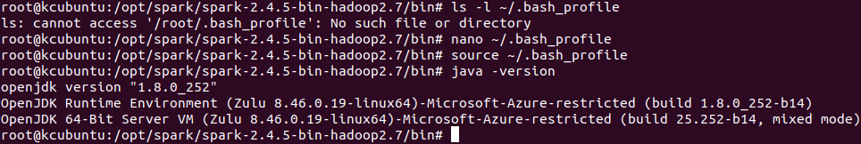
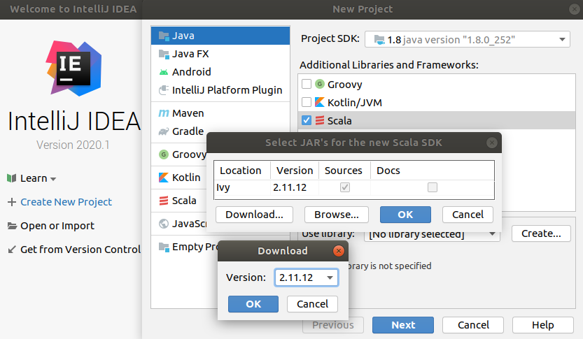
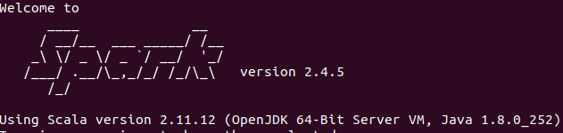

# Apache Spark | Download, Install Scala and Intellij community edition to setup developement environment for spark with Intellij

## Scenario: 

## Pre-reqs
- Following steps were all followed on linux ubuntu machine.
- Make user JAVA is installed and JAVA_HOME is set right by adding ```JAVA_HOME="/opt/java/zulu-8-azure-jdk_8.46.0.19-8.0.252-linux_x64"``` at the end of the file in /etc/environment
- Next edit ```~/.bash_profile``` create one if the file doesn't exists. Open file in nano add ```export PATH="$PATH:/opt/java/zulu-8-azure-jdk_8.46.0.19-8.0.252-linux_x64/bin"``` at the end of the line, save the file to execute source~/.bash_profile and the final output should as shown below.


## Steps
### Installing Intellij and configuring Scala plugin on Ubuntu

Use wget to download intellij communitity edition ```wget https://download.jetbrains.com/idea/ideaIE-2020.1.tar.gz```, using tar command unzip to opt folder ```tar -xf ideaIE-2020.1.tar.gz -C /opt/``` finally browse to the installaed folder ```/opt/idea-IE-201.6668.155``` to exectue ```./bin/idea.sh``` to open Injellij IDE. Click on configure on the welcom to intellij IDEA screen, select plugin to open a new window with the list of plugins search for scala make sure scala is installed and close the intellij to create a new project using intellij.


open intelliJ IDEA on 'welcome to intelliJIDEA' screen select create New Project, under 'new project' select Scala and then click on create if the library is not selected. I have got a screen capture of how to verify scala version used in Spark note the scala version. NExt step is to select the library, click on create, select the version 2.11.12 as that is the verion our spark was compiled click ok on download and then on select JAR's for the new scala SDK.



Verified the version of scala used in Spark-2.4.5.

