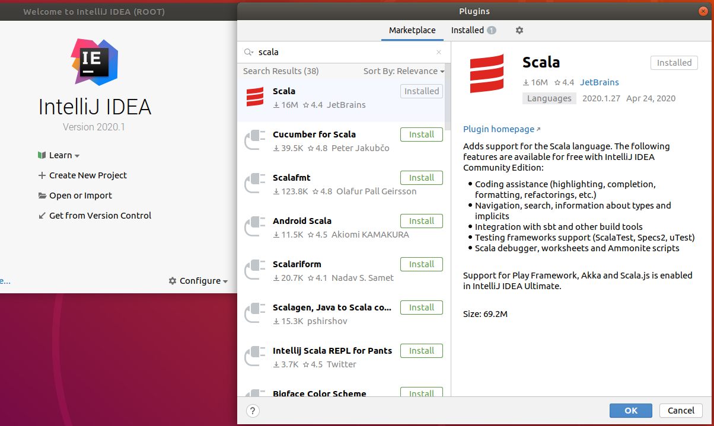

# Apache Spark | Download, Install Scala and Intellij community edition to setup developement environment for spark with Intellij

## Scenario: 

## Pre-reqs
- Following steps were all followed on linux ubuntu machine.
- Make user JAVA is installed and JAVA_HOME is set right by adding ```JAVA_HOME="/opt/java/zulu-8-azure-jdk_8.46.0.19-8.0.252-linux_x64"``` at the end of the file in /etc/environment
- Next edit ```~/.bash_profile``` create one if the file doesn't exists. Open file in nano add ```export PATH="$PATH:/opt/java/zulu-8-azure-jdk_8.46.0.19-8.0.252-linux_x64/bin"``` at the end of the line, save the file to execute source~/.bash_profile and the final output should as shown below.


## Steps
### Installing Intellij, configuring Scala plugin and create your first Spark Spala application on Ubuntu

#### Download Intlelij and configure Scala plugin
Use wget to download intellij communitity edition ```wget https://download.jetbrains.com/idea/ideaIE-2020.1.tar.gz```, using tar command unzip to opt folder ```tar -xf ideaIE-2020.1.tar.gz -C /opt/``` finally browse to the installaed folder ```/opt/idea-IE-201.6668.155``` to exectue ```./bin/idea.sh``` to open Injellij IDE. Click on configure on the welcom to intellij IDEA screen, select plugin to open a new window with the list of plugins search for scala make sure scala is installed and close the intellij to create a new project using intellij.


#### Select Scala SDK in IntelliJ
Open intelliJ IDEA, on 'welcome to intelliJIDEA' screen select create New Project and then under 'new project' select Scala to proceed to click on create if the library is not selected. Screen capture below shows how to verify scala version in Spark shell, note the scala version. 

Verified Scala version used in Spark-2.4.5.


Next step is to select the library, click on create, select the version 2.11.12 as that is the verion our spark was compiled click ok on download, then on select JAR's for the new scala SDK  Select  '2.11.12' this will take sometime to download the jars. Next under 'select JARs for the new scala SDK' select 2.11.12 jar to click ok and this will populate the 'Use library' dropdown. 


#### Create Spark Scala project
Click 'next' for show 'New Project' screen to appear, here enter project name 'SparkWordCount' and select a path to create your first project and finish to create a new project. In the idea project right click on 'src' -> 'New' -> 'Scala Class' enter the name 'ScalaWordCount'. Copy paste the code shown below,observe most of the Classes and Methods related to spark will not be recoginised. 

```
import org.apache.spark.{SparkContext,SparkConf}

object ScalaWordCount {

  def main(args: Array[String]): Unit = {
    println("Hello")
    val conf = new SparkConf().setAppName("First Scala Word Count")//.setMaster("local")
    val sc = new SparkContext(conf)
    sc.setLogLevel("DEBUG")
    val textFile = sc.textFile("/var/log/syslog")
    val counts = textFile.flatMap(line => line.split(" "))
      .map(word => (word, 1))
      .reduceByKey(_ + _)
    counts.saveAsTextFile("/home/user/output1")
    //println(counts.count())

  }
}
```


This is when references to spark 'spark-code_2.11-2.4.5.jar', haoop 'hadoop-common-2.7.3.jar' and 'jackson-annotations-2.6.7.jar'need to be added. Goto 'File' -> 'Project Structure' -> 'Libraries' -> click the '+' -> Java, under 'Select Library Files' browse to spark/jars to select spark-core_2.11-2.4.5.jar and repeat the same to add 'hadoop-common-2.7.3.jar' and 'jackson-annotations-2.6.7.jar'. This step should resolve all issue with references.


Code is copies, reference jars are added, next step is to setup intelliJ to build a jar file. Goto 'File' -> 'Project Structure' -> 'Artifacts' -> click the '+' -> JAR - 'From Modules with Dependencies'. Under 'Create JAR from Modules', Select Module and from the drop down pick the class containing main method. Next in the 'Output Layout' tab in the third column of the window Highlight all entries EXCEPT the compiled output of your project and delete all those other entries (click the minus button under that tab, directly above <your_project>.jar). All dependency jar would be gone except <your_project> compile output". Also check 'Include in project build'


Confirm the jars are added under External Libraries, Porject name in the sample is SparkWordCount, one can replace <your_project> in the above with SparkWordCount.


To build a jar, Goto 'Build' -> 'Build Artifacts' -> Select <your_project>.jar -> 'Build'. Once the build succeeds, jar file will be created under '/<your_pojrect>/out/artifacts/<your_project>_jar/<your_project.jar'. Now that the jar is ready why wait lets execute our sample application 

```./bin/spark-submit --class ScalaWordCount --master local SparkWordCount.jar```

