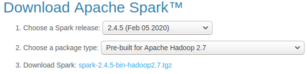
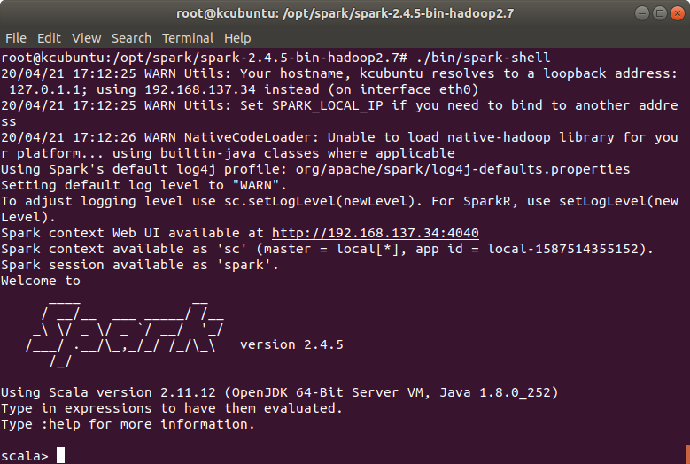
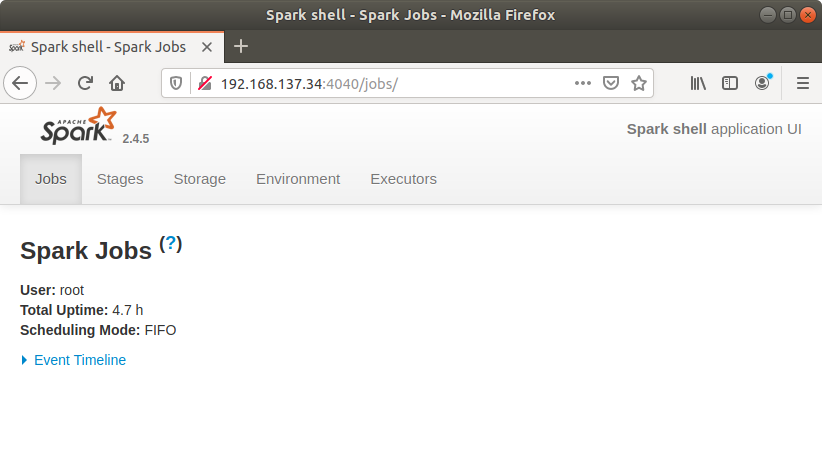
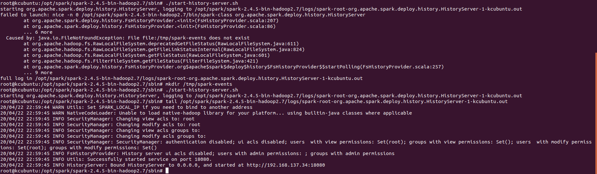
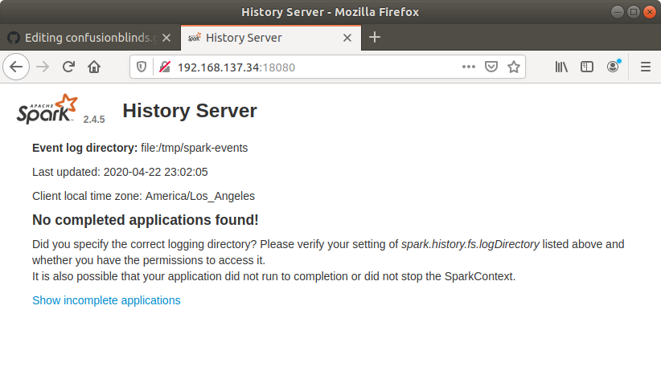

# Apache Spark | Download spark, create a local setup.

## Scenario: Learn how to download, setup up spark binary that are ready to execute sample locally on a linux machine.

## Pre-reqs
- Following steps were all followed on linux ubuntu machine.
- Make user JAVA is installed and JAVA_HOME is set right by adding ```JAVA_HOME="/opt/java/zulu-8-azure-jdk_8.46.0.19-8.0.252-linux_x64"``` at the end of the file in /etc/environment

- /etc/environment is a system-wide configuration file, which is used by all users.
- Ubuntu 18.04 ships with Python 3, as the default Python installation, check if python3 is already installed using command python3 --version. Use command sudo apt-get install python3.6 to install latest version of Python if not already installed.

## Steps
- Browse to [Apache Spark download page](http://spark.apache.org/downloads.html), select the spark prebuild with hadoop.


- Download the package using wget, this will get downloaded
```
wget http://apache.mirrors.hoobly.com/spark/spark-2.4.5/spark-2.4.5-bin-hadoop2.7.tgz -P /home/username/Downloads
```

- Extract the tgz to a desired location, in this case the file will be extracted to "/opt/spark"
```
sudo tar -xf spark-2.4.5-bin-hadoop2.7.tgz -C /opt/spark/
```
- Test if spark-shell gets started, browser to folder where spark binaries were extracted, ```cd /opt/spark/spark-2.4.5-bin-hadoop2.7``` and execute ```./bin/spark-shell``` command this should successfully start spark, display spark verion banner and stop at a scala prompt.



- Launching spark web UI : In local mode spark shell runs as an application, web UI provides details about the stages, storage(cached RDDs), Environment variables and executors. Observe the Spark context Web UI URL in the image above, open a browse to key in the ip:port that you see on the command prompt. In this case it was 192.168.137.34:4040



### Access the power of Spark using Python
Pyspark : A python API written in python to support Apache spark. PySpark is a wrapper around Spark core. When spark session is started in Python in the background, PySpark uses Py4j to launch a Java virtual machine and creates a Java Spark context.All Py4j does is allow Python programs to dynamically access Java objects in a Java virtual machine. Readmore about Py4j [here](https://www.py4j.org/)

Check pyspark is working successfully, by changing the directory to ```cd /opt/spark/spark-2.4.5-bin-hadoop2.7``` and execute ```./bin/pyspark ``` command. 

If pyspark command fails with ```./bin/pyspark: line 45: python: command not found
env: ‘python’: No such file or directory```, set environment variable ```export PYSPARK_PYTHON=python3```

### Monitoring and Instrumentaion using Spark history server
Start history server by  execting start-history-server.sh located in spark ```/sbin``` folder, in this case  ```/opt/spark/spark-2.4.5-bin-hadoop2.7/sbin/start-history-server.sh``` and it failed with following error. Create a folder 'spark-events' under '/tmp' folder to start the history server successfully.

Output
```
starting org.apache.spark.deploy.history.HistoryServer, logging to /opt/spark/spark-2.4.5-bin-hadoop2.7/logs/spark-root-org.apache.spark.deploy.history.HistoryServer-1-kcubuntu.out
failed to launch: nice -n 0 /opt/spark/spark-2.4.5-bin-hadoop2.7/bin/spark-class org.apache.spark.deploy.history.HistoryServer
  	at org.apache.spark.deploy.history.FsHistoryProvider.<init>(FsHistoryProvider.scala:207)
  	at org.apache.spark.deploy.history.FsHistoryProvider.<init>(FsHistoryProvider.scala:86)
  	... 6 more
  Caused by: java.io.FileNotFoundException: File file:/tmp/spark-events does not exist
```
- Following image shows the error message, command to create a folder under tmp folder this is the default setting, restarting Spark history server, spark history server log location that  is located under spark installation folder and finally observe the last but one line to confirm the ip:port combination where spark history server got started. In this case it was 'http://192.128.137.34:18080'


- Spark history UI, if you had any application complete and yet it doesn't show up the follow the next step.  

- Make a copy of spark-defaults.conf.template to spark-defaults.conf under ```/conf``` folder using command ```cp spark-defaults.conf.template  spark-defaults.con``` and uncomment **spark.eventlog.enabled=true**  and start spark-shell execute a spark application and browse to Spark-history UI to view the complete / incomplete applications.
  
## Exploring Folders
- /bin  : Conatins Shell scripts that are used to sumbit spark application.
- /conf : Spark configuration, Logging properties, spark enironment templates are stored in conf folder.
- /jars :
- /sbin :

## Explaining Spark application concepts using a sample spark Application
- Spark Application : Spark application is a Scala /  Python / R that makes use of Spark API, Sparksession is an entry point for Spark API. Starting Spark 2.0 way to use Spark API is to create a sparkSesion object.
- Sparksession object can be used to created RDD,Dataframes and Datasets, using RDDs, Dataframes and Datasets you leverage Spark API.
- Job
- Stage 
- Task

