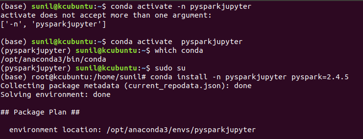

# Apache Spark | setup Pyspark

## Scenario: Configure python3 to start pyspark

## Pre-reqs
Ubuntu 18.04 ships with Python 3, as the default Python installation, check if python3 is already installed using command ```python3 --version```. Use command ```sudo apt-get install python3.6``` to install latest version of Python if not already installed.  


## Package Managers

**pip** is a package manager that facilitates installation, upgrade, and uninstallation of python packages. It also works with virtual python environments. **conda** is also packaging tool that handles installation task (installation, upgrade and uninstallation) for both python and non-Python. And, also works with virtual system environments.
[Understanding Conda and Pip](https://www.anaconda.com/understanding-conda-and-pip/)

## Steps to install pip (pip3) for Python 3:
Run ```sudo apt install python3-pip``` to install pip for Python3, check pip version using ```pip3 --version```
output should be similar to ```pip 9.0.1 from /usr/lib/python3/dist-packages (python 3.6)```

_This was just to show how to install pip, mostly conda is the preferred distribution that is recommend_

##  Anaconda : What is?
Anaconds is a package distribuion, to install prebuilt and preconfigured collection of packages and conda is the package manager part of Anaconda. Anaconda is preferred method to install Jupyter notebook. Apart from installing Python, Jupyter notebook Anaconda also installs NumPy, pandas and many other packages.

Installing Anaconda:
TBD 

Using `Whereis` command confirm Python & Anaconda installed

```
(base) sunil@kcubuntu:~$ whereis conda
conda: /opt/anaconda3/bin/conda /opt/anaconda3/condabin/conda

(base) sunil@kcubuntu:~$ whereis python
python: /usr/bin/python2.7 /usr/bin/python3.6 /usr/bin/python3.6-config /usr/bin/python3.6m-config /usr/bin/python /usr/bin/python3.6m /usr/lib/python2.7 /usr/lib/python3.7 /usr/lib/python3.6 /usr/lib/python3.8 /etc/python2.7 /etc/python3.6 /etc/python /usr/local/lib/python2.7 /usr/local/lib/python3.6 /usr/include/python3.6 /usr/include/python3.6m /usr/share/python /opt/anaconda3/bin/python3.7 /opt/anaconda3/bin/python3.7m-config /opt/anaconda3/bin/python3.7-config /opt/anaconda3/bin/python /opt/anaconda3/bin/python3.7m /usr/share/man/man1/python.1.gz

(base) sunil@kcubuntu:~$ whereis python3
python3: /usr/bin/python3.6 /usr/bin/python3.6-config /usr/bin/python3.6m-config /usr/bin/python3.6m /usr/bin/python3 /usr/lib/python3.7 /usr/lib/python3.6 /usr/lib/python3.8 /usr/lib/python3 /etc/python3.6 /etc/python3 /usr/local/lib/python3.6 /usr/include/python3.6 /usr/include/python3.6m /usr/share/python3 /opt/anaconda3/bin/python3.7 /opt/anaconda3/bin/python3.7m-config /opt/anaconda3/bin/python3.7-config /opt/anaconda3/bin/python3.7m /opt/anaconda3/bin/python3 /usr/share/man/man1/python3.1.gz


(base) sunil@kcubuntu:~$ whereis anaconda
anaconda: /opt/anaconda3/bin/anaconda
```

## Python Virtual Envrionment : Isolated python virtual environment that can be customized per project.

### Why ?
By Default all python packages are installed to a single directory on the system, which can become a problem when building multiple python projects that has different and potential conflicting depends, this problem can be solve y busing  Virtual Environment.

### How ?
Create new Directory for each Virtual Environment, with links to system's Python executable, Library and Tools. Provide sub-directories for installing additional python packages. To quickly create an environment using conda, you can type in the following command, observe ‘conda create’ command will effectively load all of the packages at once.  

```
sudo /opt/anaconda3/condabin/conda create --prefix /opt/anaconda3/envs/python36env python=3.6 anaconda --yes
```

- `/opt/anaconda3/condabin/conda` is the conda path
- `--prefix` specifie full path to environment location to create a conda virtual environment, `python36env` is the virtual envrionment name and this virtual environment is configured to use `Python=3.6`

- Display all the current environments `conda info --envs`

- To use one of the environment listed use `conda activate` combine with the path to the environment that would be `conda activate /opt/anaconda3/envs/python36env` to use the newly created python virtual environment. And to stop using the environment type in `conda deactivate`. Finally `conda remove  --prefix /opt/anaconda3/envs/python36env --all`.


Launching Jupyter: Once you launch python env type `jupyter notebook` to launch jupyter, URLs shown in python command prompt could be used to launch jupyter if the browser should get closed and finally session can be shutdown by typing `ctrl+c` in python command or by click on `Quit` twice.

## Connecting Jupyter notebooks to Spark
Tale of two approaches to get PySpark available in a Jupyter Notebook.
  - Configure PySpark driver to use Jupyter Notebook: running pyspark will automatically open a Jupyter Notebook
  - Load a regular Jupyter Notebook and load PySpark using findSpark package

Lets setup our virtual environment to demonstrate both these approachs.

Create a virtual environment call `pysparkjupyter`, activate that environment and install pyspark part of that environment.
```
  sudo /opt/anaconda3/condabin/conda create --prefix /opt/anaconda3/envs/pysparkjupyter python=3.6 anaconda --
  
  conda activate /opt/anaconda3/envs/pysparkjupyter
  
  conda install -n pysparkjupyter pyspark=2.4.5
  
```


https://docs.conda.io/projects/conda/en/latest/user-guide/tasks/manage-environments.html#saving-environment-variables


```

(pysparkdriver) root@kcubuntu:/home/sunil# conda env confg vars list
usage: conda-env [-h] {create,export,list,remove,update,config} ...
conda-env: error: invalid choice: 'confg' (choose from 'create', 'export', 'list', 'remove', 'update', 'config')
(pysparkdriver) root@kcubuntu:/home/sunil# conda env config vars list
(pysparkdriver) root@kcubuntu:/home/sunil# conda env config vars set PYSPARK_DRIVER_PYTHON=jupyter -p /opt/anaconda3/envs/pysparkdriver/
To make your changes take effect please reactivate your environment
(pysparkdriver) root@kcubuntu:/home/sunil# conda env config vars set PYSPARK_DRIVER_PYTHON_OPTS='notebook' -p /opt/anaconda3/envs/pysparkdriver/
To make your changes take effect please reactivate your environment
(pysparkdriver) root@kcubuntu:/home/sunil# conda env config vars list
PYSPARK_DRIVER_PYTHON = jupyter
PYSPARK_DRIVER_PYTHON_OPTS = notebook

```

## findspark
```python3 -m pip install findspark
```

Output
```
Collecting findspark
  Using cached https://files.pythonhosted.org/packages/b1/c8/e6e1f6a303ae5122dc28d131b5a67c5eb87cbf8f7ac5b9f87764ea1b1e1e/findspark-1.3.0-py2.py3-none-any.whl
Installing collected packages: findspark
Successfully installed findspark-1.3.0
```


